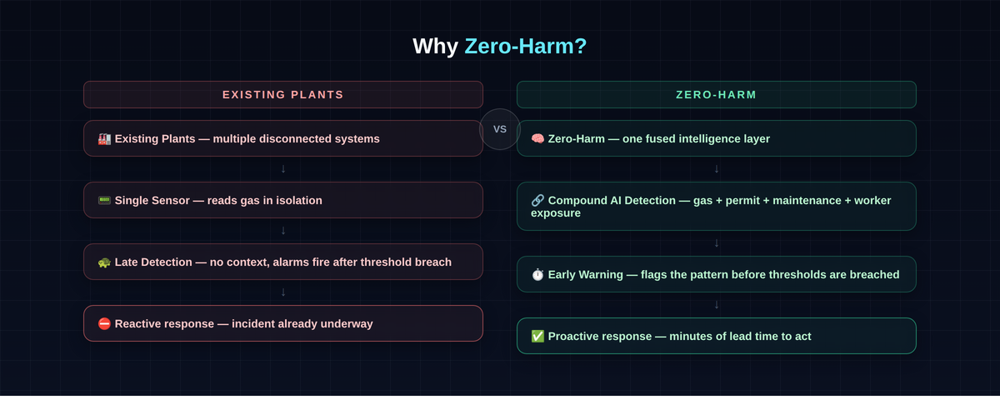
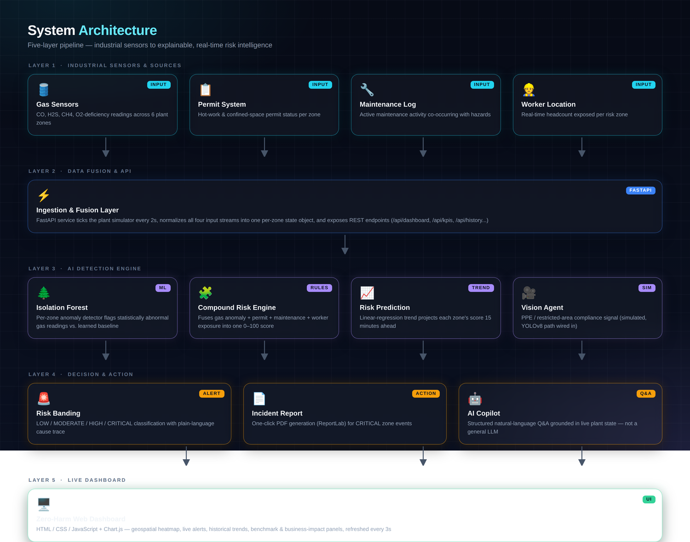
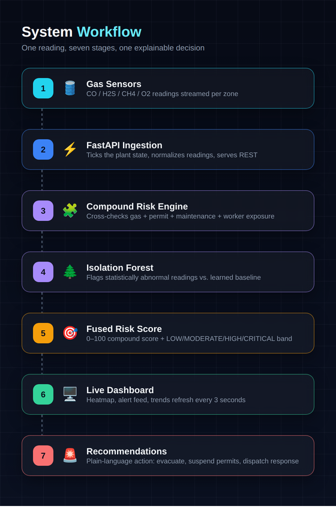
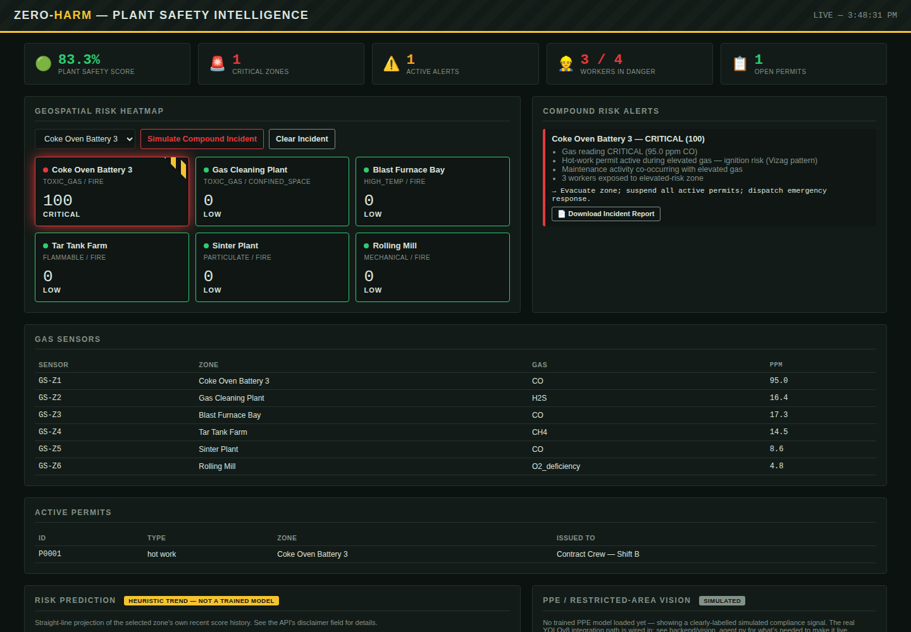
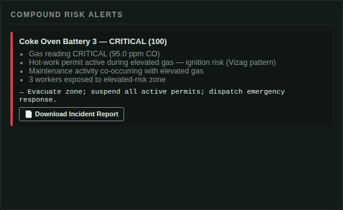
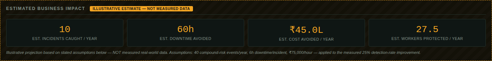
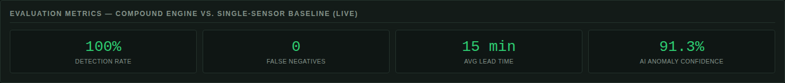
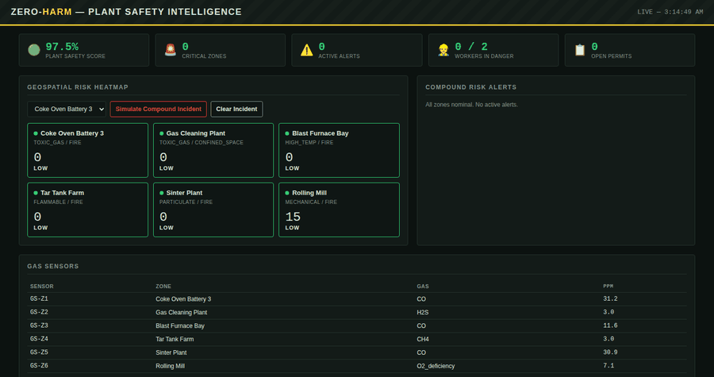

# Zero-Harm — AI-Powered Industrial Safety Intelligence

Zero-Harm is a compound risk detection platform for heavy industrial plants. It fuses
gas sensor readings, active work permits, maintenance activity, and worker location
into a single real-time risk score per zone — catching dangerous combinations that no
single sensor or system would flag alone.

The flagship scenario is modelled directly on the January 2025 Visakhapatnam Steel
Plant coke oven incident: a hot-work permit issued in a zone with rising gas levels
during active maintenance.

---

## 🤔 Why Zero-Harm?



Most plants already have gas sensors, permit systems, and maintenance logs — they just
don't talk to each other. Zero-Harm doesn't add another sensor; it reads the ones that
already exist as one correlated picture, so a hazardous *combination* of otherwise
individually-normal signals gets caught before it becomes an incident.

## 🏗️ Architecture



Five layers: industrial sensors & sources → FastAPI ingestion/fusion → the AI detection
engine (Isolation Forest + the compound risk engine + trend prediction + vision) →
decision & action outputs → the live dashboard. Full write-up in
[`docs/Zero-Harm_Technical_Documentation.pdf`](docs/Zero-Harm_Technical_Documentation.pdf).

**Layer breakdown**

| Layer | Component | Role |
|---|---|---|
| 1 — Sensors & Sources | Gas sensors, permits, maintenance log, worker location | Raw signal capture across 6 plant zones |
| 2 — Data Fusion | FastAPI ingestion layer | Ticks the simulator every 2s, normalizes all streams, serves REST |
| 3 — AI Engine | Isolation Forest, Compound Risk Engine, Risk Prediction, Vision Agent | Detects anomalies and fuses them into one explainable score |
| 4 — Decision Support | Risk banding, incident reports, AI Copilot | Turns a score into a plain-language recommendation and an action |
| 5 — Dashboard | HTML / CSS / JS + Chart.js | Real-time geospatial view, refreshed every 3 seconds |

## 🔀 System Workflow

<p align="center"></p>

## 🛠️ Tech Stack

- **Backend:** Python, FastAPI
- **AI / ML:** Scikit-learn (Isolation Forest anomaly detection)
- **Frontend:** HTML, CSS, JavaScript, Chart.js

## 🖼️ Dashboard Preview

| Dashboard | Risk Alert |
|---|---|
|  |  |

| Business Impact | Benchmark |
|---|---|
|  |  |

*All four are real captures of the running app (headless-browser screenshots against the
live FastAPI backend) — not mockups.*

### Live Demo



*A compound incident being triggered on Coke Oven Battery 3 — the zone escalates to
CRITICAL, an explainable alert appears with recommended action, then clears.*

## 📈 Performance

Measured live from `GET /api/benchmark`, reproducible with `Zero-Harm_Baseline_Comparison_Script.py`:

| Metric | Single-Sensor Baseline | Zero-Harm Compound Engine |
|---|---|---|
| Precision | 1.00 | 1.00 |
| Recall (Detection Rate) | 0.75 | **1.00** |
| F1 Score | 0.857 | **1.00** |
| Accuracy | 0.833 | **1.00** |
| False Negatives | 1 | **0** |
| Avg. Lead Time | — | **15 min** |
| AI Anomaly Confidence | — | **91.3%** |

> Evaluated on the same 4-scenario suite (3 baseline-detectable + 1 compound-only) both
> systems are run against. See `benchmark.py` for the scenario definitions and the
> "Honesty note" further down for what's excluded and why.

**Estimated business impact** (explicitly labelled as an illustrative projection, not
measured data — see assumptions in `benchmark.py`):

| Metric | Estimate |
|---|---|
| Additional incidents caught / year | 10 |
| Downtime avoided / year | 60 hours |
| Cost avoided / year | ₹45.0 L |
| Workers protected / year | 27.5 |

## 📄 Full Documentation

See [`docs/Zero-Harm_Technical_Documentation.pdf`](docs/Zero-Harm_Technical_Documentation.pdf)
for the complete write-up, including system architecture, the compound risk scoring
methodology, the full API reference, measured Precision/Recall/F1/Accuracy results,
the regulatory compliance mapping, and an honest, assumption-labelled business impact
estimate methodology.

## 📊 Live Dashboard Panels

The dashboard (`http://localhost:8000`) includes, top to bottom:

- **Plant Health bar** — Plant Safety Score, Critical Zones, Active Alerts, Workers in
  Danger, Open Permits — from `GET /api/kpis`.
- **Geospatial Risk Heatmap** — live zone map with a "Simulate Compound Incident" control.
- **Compound Risk Alerts** — explainable triggers, recommended action, and a
  **Download Incident Report** button per alert (`GET /api/report/{zone_id}`, a PDF).
- **Risk Prediction** — current vs. 15-minute-projected risk for the selected zone.
  Badged `HEURISTIC TREND — NOT A TRAINED MODEL`: it's a linear-regression
  extrapolation of the zone's own recent score history (`GET /api/predict/{zone_id}`),
  not a trained forecaster. See `backend/risk_prediction.py` for the full scope note.
- **PPE / Restricted-Area Vision** — badged `SIMULATED` by default. The real YOLOv8
  integration path is wired into `backend/vision_agent.py` and works the moment a
  PPE-fine-tuned model file is available (`ultralytics` is commented out in
  `requirements.txt` until then). **Why simulated:** stock YOLOv8 checkpoints have no
  helmet/vest classes — genuine detection needs a model fine-tuned on a labelled PPE
  dataset, which needs training data and GPU time this build didn't have. See that
  module's docstring for the full explanation; be upfront about this if a judge asks.
- **Historical Analytics** — zone risk-score trend chart and a zone-wise safety table,
  from `GET /api/history` / `GET /api/history/{zone_id}`. In-memory rolling buffer
  (resets on restart) — the natural production upgrade is a time-series database.
- **Incident Timeline** — chronological log combining permit/maintenance events
  (logged the moment `trigger_incident`/`clear_incident` runs) with every real
  risk-level transition detected in the background loop (e.g. "LOW → CRITICAL"),
  from `GET /api/timeline`. Nothing here is scripted for the demo — it's a genuine
  record of what the simulator and risk engine did.
- **Live toast notifications** — a toast pops up the moment a zone's alert first
  reaches MODERATE/HIGH/CRITICAL, read directly off the same alerts array already
  rendered in the Compound Risk Alerts panel — not a separate, fakeable data path.
- **12-person worker roster with roles** (Engineer, Supervisor, Operator, Safety
  Officer, Contractor, Maintenance Crew) that move between zones every few ticks,
  simulating RFID/BLE badge pings — workers already inside an active incident zone
  stay put rather than wandering out mid-emergency.
- **AI Copilot** — badged `STRUCTURED Q&A — NOT A GENERAL LLM`. Recognizes question
  shapes like "why is Blast Furnace Bay critical?", "show active permits", "recommend
  corrective action for Zone 3" and answers by reading the live plant state directly —
  every answer is grounded and reproducible. It is **not** a general-purpose LLM;
  `backend/copilot.py` documents exactly where a real LLM call would go if you want to
  upgrade it (this environment had no network access to add and verify one).
- **Evaluation Metrics** & **Estimated Business Impact** — fed live from
  `GET /api/benchmark`; the business-impact numbers carry an explicit
  "ILLUSTRATIVE ESTIMATE" badge and dashed border so they're never confused with the
  measured detection metrics beside them.

## 🧪 Try the Measured Results Yourself

```bash
pip install scikit-learn numpy matplotlib   # matplotlib optional, for charts
python3 Zero-Harm_Baseline_Comparison_Script.py
```

This reproduces every number in Section 11 of the documentation, and additionally:
- Prints Precision / Recall / F1 / Accuracy for both systems
- Prints lead-time statistics (average, median, min, max)
- Prints a bonus AI-visibility test (see honesty note below)
- Exports `results.csv` and `results.json`
- Generates `chart_detection_comparison.png`, `chart_incident_timeline.png`, and `chart_risk_score_trend.png`
- Prints a final judge-ready comparison table

**Honesty note:** the bonus AI-visibility scenario is deliberately **not** folded into
the main 4-scenario detection count. With Zero-Harm's conservative AI weighting, an
anomaly signal alone stays at LOW risk in the real dashboard (by design, to avoid
alert-fatigue noise) — so claiming it as a "5th detected scenario" would misrepresent
what the live system actually does. It's reported separately, honestly, as evidence of
what the AI layer *sees* even when no rule fires.

## 🏗️ Running the Prototype

```bash
cd backend
pip install -r requirements.txt
uvicorn main:app --reload --port 8000
```

Then open `http://localhost:8000` in a browser.

**Interactive API docs:** FastAPI auto-generates them at `http://localhost:8000/docs`
(Swagger UI) and `http://localhost:8000/redoc` — worth showing judges directly, since
every endpoint below is live and testable from that page with no extra setup.

**Health check:** `GET /health` → `{"status": "healthy", "service": "Zero-Harm AI", ...}`

## 📡 API Reference

| Endpoint | Method | Description |
|---|---|---|
| `/health` | GET | Liveness check |
| `/api/dashboard` | GET | Fused payload: zones, sensors, permits, maintenance, workers, alerts, timestamp |
| `/api/zones` | GET | Plant zone master data |
| `/api/sensors` | GET | Current gas sensor readings |
| `/api/permits` | GET | Active permits |
| `/api/maintenance` | GET | Maintenance/CMMS activity |
| `/api/workers` | GET | Current worker locations |
| `/api/alerts` | GET | Current compound risk alerts, highest score first |
| `/api/kpis` | GET | Plant Safety Score, Critical Zones, Active Alerts, Workers in Danger, Open Permits |
| `/api/benchmark` | GET | Live Precision/Recall/F1, lead-time stats, business impact estimate |
| `/api/history` | GET | Zone-wise safety score summary + risk distribution |
| `/api/history/{zone_id}` | GET | Full recorded history points for one zone (for the trend chart) |
| `/api/predict/{zone_id}` | GET | Heuristic 15-minute risk trend projection for one zone |
| `/api/report/{zone_id}` | GET | Incident report PDF download for one zone |
| `/api/vision/status` | GET | Whether the vision agent is running real inference or simulated mode |
| `/api/vision/{zone_id}` | GET | PPE/restricted-area compliance signal for one zone |
| `/api/vision/{zone_id}/analyze` | POST | Upload an image frame for real YOLOv8 inference (requires a trained model) |
| `/api/copilot/ask` | POST | Structured Q&A over live plant data — `{"question": "..."}` |
| `/api/timeline` | GET | Chronological incident timeline — permit/maintenance events + real risk-level transitions |
| `/api/simulate/incident/{zone_id}` | POST | Triggers the demo compound-risk scenario in a zone |
| `/api/simulate/clear/{zone_id}` | POST | Resets a zone to baseline |

## 📁 Repository Structure

```
├── docs/
│   ├── Zero-Harm_Technical_Documentation.pdf     ← full submission document
│   ├── Zero-Harm_Technical_Documentation.docx
│   ├── Zero-Harm_Regulatory_Compliance_Mapping.pdf
│   ├── banner/banner.png                          ← README banner (NEW)
│   ├── architecture/architecture_v2.png           ← architecture diagram (NEW)
│   ├── diagrams/system_workflow.png               ← workflow diagram (NEW)
│   ├── diagrams/why_zeroharm.png                  ← comparison graphic (NEW)
│   ├── screenshots/                               ← real app captures (NEW)
│   └── demo.gif                                   ← animated live demo (NEW)
├── backend/                                       ← FastAPI app (implemented & tested)
│   ├── main.py                                    ← all API endpoints
│   ├── risk_engine.py                             ← compound scoring, 4 rule agents
│   ├── anomaly_detector.py                        ← Isolation Forest AI layer
│   ├── data_simulator.py                          ← in-memory plant simulator
│   ├── benchmark.py                               ← live Precision/Recall/F1 + business impact estimate
│   ├── history.py                                 ← rolling history buffer
│   ├── risk_prediction.py                         ← heuristic trend-based prediction
│   ├── report_generator.py                        ← incident report PDF builder
│   ├── vision_agent.py                             ← YOLOv8 PPE integration + simulated fallback
│   ├── copilot.py                                 ← structured Q&A over live data
│   └── requirements.txt
├── frontend/
│   └── index.html                                 ← dashboard: health bar, heatmap, alerts,
│                                                      prediction, vision, analytics, copilot,
│                                                      evaluation metrics, business impact
├── Zero-Harm_Baseline_Comparison_Script.py         ← standalone measured-results demo
├── LICENSE                                        ← MIT
└── README.md
```

All code above is implemented and tested at the module level (see the honesty notes
above for the two features — PPE vision and the AI copilot — that ship with a clearly
labelled simulated/structured mode rather than a fully trained model or general LLM).

## 🎯 Judging Criteria Alignment

| Criterion | Weight | How this addresses it |
|---|---|---|
| Innovation | 25% | Multi-agent compound correlation, an Isolation Forest anomaly layer, a wired (if not yet trained) computer-vision path, and a live structured Q&A copilot — not single-sensor alerting |
| Business Impact | 25% | Modelled on a real, named incident (Vizag, Jan 2025), with measured detection numbers, an incident-report PDF generator, and an honestly labelled business-impact estimate |
| Technical Excellence | 20% | Typed data contracts, clean layer separation, swap-in path to real data sources and a real trained vision model without redesign |
| Scalability | 15% | Stateless FastAPI service, independent per-zone assessment, rolling in-memory history with a clear DB upgrade path |
| User Experience | 15% | Live geospatial heatmap, explainable alerts, one-click incident reports, and at-a-glance KPI cards |

## 🚫 What We Deliberately Did Not Fake

A few tempting additions were considered and specifically **not** built, because they
would have meant showing a judge something that looks like AI output but isn't real:

- **A live camera feed with bounding boxes drawn over a video stream.** Without a
  trained PPE-detection model actually running (see `vision_agent.py`'s honest
  "simulated" mode above), rendering fake bounding boxes over footage would be
  presenting fabricated detections as real computer vision. The vision agent instead
  clearly labels itself `SIMULATED` and documents exactly what's needed to make it
  real — that's a more defensible position in front of a judge who asks "is this
  actually detecting anything right now?"
- **A persistent database (SQLite/PostgreSQL).** This is a legitimate production
  upgrade — see Future Scope below — but swapping the in-memory state for a real
  database this close to submission risked destabilizing a system that is now fully
  tested end-to-end, for a change judges can't see in a 3-4 minute demo. Documented
  as the clear next step instead of rushed in.

## 🔭 Future Scope

- ✔ IoT Integration
- ✔ Drone Inspection
- ✔ CCTV AI
- ✔ Digital Twin
- ✔ Predictive Maintenance
- ✔ LLM Safety Assistant
- ✔ Persistent database (SQLite/PostgreSQL) replacing in-memory state, for
  multi-session history and multi-instance deployment

## 📜 License

This project is licensed under the [MIT License](LICENSE). Submitted for ET AI
Hackathon 2026 evaluation purposes.
